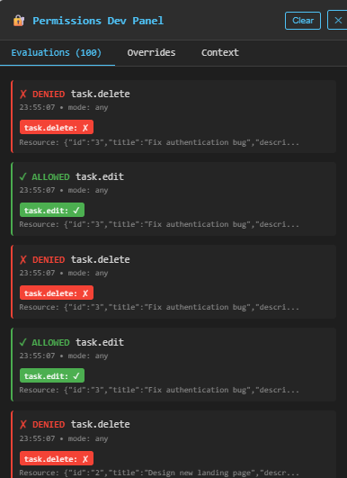
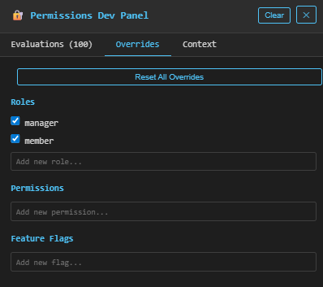
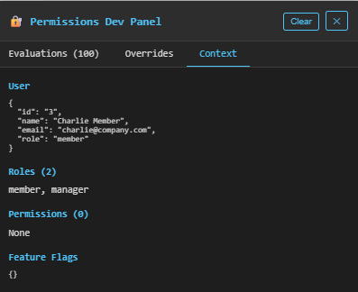

# React Auth Gate

A **production-grade React authorization framework** that centralizes RBAC, PBAC, ABAC, feature flags, and async permission checks into a clean, declarative API.

[](https://www.npmjs.com/package/react-auth-gate)
[](https://opensource.org/licenses/MIT)

---

## ✨ Features

- 🎯 **Declarative Permission Checks** - Use components and hooks for clean, readable code
- 🔐 **Multiple Access Control Models** - RBAC, PBAC, ABAC all in one library
- 🚀 **Async Rule Support** - Check permissions against databases or APIs
- 🎛️ **Feature Flags** - Toggle UI features dynamically
- 🛠️ **Dev Panel** - Debug and override permissions in development
- ⚡ **Tree-shakeable** - Only bundle what you use
- 📦 **TypeScript First** - Fully typed with excellent IntelliSense
- 🎨 **Framework Agnostic** - Works with any React setup

---

## 🚀 Quick Start

### Installation

```bash
npm install react-auth-gate
```

### Basic Usage

```tsx
import { PermissionsRoot, PermissionsGate, usePermission } from 'react-auth-gate';

const rules = {
  'admin.access': ({ roles }) => roles.includes('admin'),
  'post.edit': ({ user, resource }) => resource.authorId === user.id,
};

function App() {
  return (
    <PermissionsRoot user={currentUser} roles={['editor']} rules={rules}>
      <PermissionsGate allow="admin.access">
        <AdminPanel />
      </PermissionsGate>
      
      <PermissionsGate allow="post.edit" resource={post}>
        <EditButton />
      </PermissionsGate>
    </PermissionsRoot>
  );
}
```

---

## 📚 Core Components

### `<PermissionsRoot>`

Wrapper provider that automatically integrates dev tools in development.

```tsx
<PermissionsRoot
  user={currentUser}
  roles={['admin', 'editor']}
  permissions={['post.edit', 'post.delete']}
  rules={customRules}
  flags={{ newUI: true }}
>
  <App />
</PermissionsRoot>
```

### `<PermissionsGate>`

Conditional rendering based on permissions.

```tsx
<PermissionsGate 
  allow="post.edit" 
  resource={post}
  fallback={<DisabledButton />}
>
  <EditButton />
</PermissionsGate>
```

### `usePermission()` Hook

Programmatic permission checks.

```tsx
const { allowed, loading } = usePermission('post.edit', post);

if (loading) return <Spinner />;

return (
  <button disabled={!allowed}>
    Edit Post
  </button>
);
```

---

## 🎛️ Dev Tools Panel

The built-in dev panel lets you:
- 🔍 View all permission checks in real-time
- ✏️ Override roles, permissions, and flags
- 🐛 Debug authorization logic
- 📊 Track evaluation history

**Automatically enabled in development mode!**

### Screenshots

**Evaluations Tab** - See all permission checks in real-time:



**Overrides Tab** - Override roles, permissions, and feature flags:



**Context Tab** - View current user context:



---

## 📖 Documentation

- [Getting Started Guide](./getting-started.html)
- [API Reference](./api.html)
- [Examples](https://github.com/klejdi94/react-auth-gate/tree/master/examples)

---

## 🔗 Links

- [GitHub Repository](https://github.com/klejdi94/react-auth-gate)
- [npm Package](https://www.npmjs.com/package/react-auth-gate)
- [Report Issues](https://github.com/klejdi94/react-auth-gate/issues)

---

## 📝 License

MIT © [Klejdi 2K](https://github.com/klejdi94)
